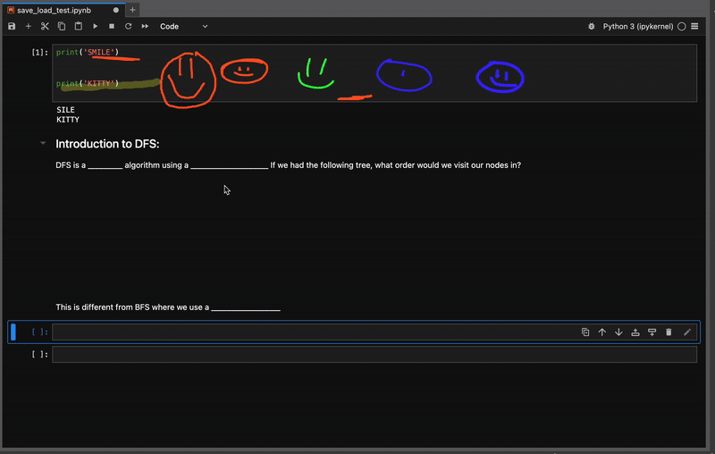

# 🖊️ Jupyter Annotation Tool for JupyterLab

**Jupyter Annotation Tool (ipynbd)** lets you **draw annotations directly on top of notebook cells** — using your mouse or stylus (including Apple Pencil).  
It’s designed for teaching, demos, and visual note-taking inside `.ipynb` notebooks, while keeping all drawings stored in notebook metadata.



---

## 🚀 Current Status

✅ **Working features:**
- The extension installs successfully as a **federated JupyterLab 4 plugin**.  
- Adds a **“Draw (cell)”** button to the notebook toolbar.  
- Clicking the button toggles a **canvas overlay** for the **active cell**, where drawings are rendered.  
- Drawings persist in the notebook under `cell.metadata.overlay_v1`.  
- Fully integrated with JupyterLab’s reactive layout (auto-resizes with cells, supports zoom, dark mode, etc.).  

🧩 **Upcoming / In progress:**
- Persistent per-cell draw toggle and global “annotation mode”.
- Better and more intuitive scaling/translation as cell dimensions change
- Undo-redo stack
- Annotation selection and moving
- Pressure sensitivity
- Exportable to PDF/HTML
- Generally Better UI/UX
- Integration beyond Jupyterlab (primarily vscode)
- Live annotation in shared sessions
- Annotation layers
- Auto-theme color sync
- Optional cell grid/line/dot underlays

---

## 🧠 Project Overview

This extension adds a thin, high-Z-index `<canvas>` to each cell’s DOM tree:

```html
<div class="jp-Cell-content">
  ... existing cell content ...
  <canvas data-overlay="1" style="position:absolute; inset:0; z-index:1000"></canvas>
</div>
```

Each drawing is recorded as an array of **normalized strokes**:

```json
{
  "overlay_v1": {
    "strokes": [
      {
        "tool": "pen",
        "color": "#ffffff",
        "width": 0.003,
        "points": [[0.12, 0.45], [0.13, 0.46], ...]
      }
    ]
  }
}
```

Normalization (0–1) means the drawing scales with cell size on resize or zoom.  
On load, `ResizeObserver` re-renders from metadata.

---

## 📥 Installation

```bash
# Install the federated extension (Python + front-end assets)
pip install jupyter-annotation-tool-ipynbd

# (Optional) install straight from npm if you prefer front-end only
jupyter labextension install jupyter-annotation-tool-ipynbd
```

```bash
# For contributors: link your local checkout instead of installing from PyPI
pip install -e .
```

### Prerequisites
- Node.js ≥ 18
- Python ≥ 3.10
- JupyterLab ≥ 4.0

### Create a virtual environment
```bash
python -m venv jlab-env
source jlab-env/bin/activate
```

### Install dependencies
```bash
npm install
pip install -e .
```

### Build & reload into JupyterLab
Use the provided `build.sh` script:
```bash
#!/bin/bash
set -e
echo "🔧 Building jupyter-annotation-tool-ipynbd..."
npm run build
pip install -e .
jupyter lab build
echo "✅ Done! Reload JupyterLab (Shift-Reload)."
```

Or manually:
```bash
npm run build && pip install -e . && jupyter lab build
```

### Launch JupyterLab
```bash
jupyter lab
```
Then open your browser (e.g. `http://localhost:8888/lab`).

---

## 🧩 Code Structure

```
jupyter_annotation_tool_ipynbd/
├── src/
│   └── index.ts          # Main plugin logic (toolbar button, overlay system)
├── lib/                  # Compiled JS output
├── labextension/         # Federated build bundle for JupyterLab
├── package.json          # JS build + labextension metadata
├── pyproject.toml        # Python packaging (for pip install)
├── tsconfig.json         # TypeScript config
├── install.json          # JupyterLab manifest
└── build.sh              # Handy rebuild script
```

---

## 🧰 Technical Details

### Event flow
1. Clicking **Draw (cell)** toggles the overlay’s `pointerEvents` for the active cell.
2. Pointer events (`pointerdown`, `pointermove`, `pointerup`) collect normalized stroke points.
3. Strokes are rendered via 2D Canvas API and saved to cell metadata.
4. On notebook reload or resize, metadata is re-drawn automatically.

### TypeScript interfaces
```ts
type Stroke = {
  tool: 'pen' | 'highlighter';
  color: string;
  width: number;
  alpha?: number;
  points: [number, number][];
};
```

---

## 🧪 Debugging

To verify the plugin loads:
1. Open **DevTools → Console** in JupyterLab.
2. Look for:
   ```
   [jupyter-annotation-tool-ipynbd] plugin activate
   ```
3. Toggle the button and confirm:
   ```
   [overlay] draw mode ON for active cell
   [overlay] pointerdown 123 456
   ```

If you see these logs, the extension is active and capturing input.

---

## 🧭 Roadmap

| Feature | Status | Notes |
|----------|---------|-------|
| Notebook toolbar button | ✅ | Working |
| Per-cell toolbar pen icon | 🧩 In progress | Right-aligned next to delete |
| Color picker / width selector | 🧩 Planned | Popover interface |
| Eraser / Undo / Clear | 🧩 Planned | Non-destructive metadata ops |
| Pencil support on iPad | ✅ | `touchAction: 'none'` ready |
| Global draw toggle | 🧩 Planned | One-click mode for all cells |

---

## 🧑‍💻 Author
Created by **William Theisen**  
Built for interactive teaching, annotation, and in-class demonstration notebooks.
